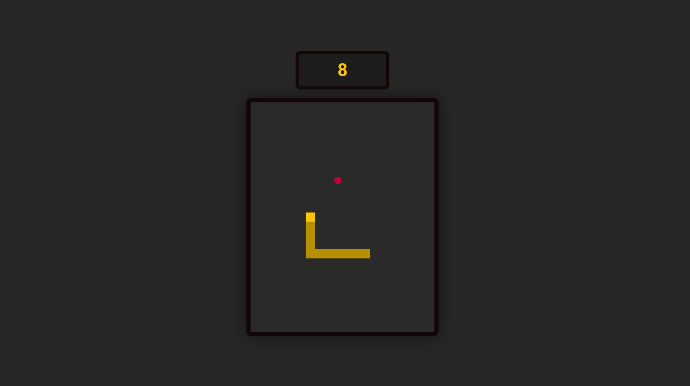

<h1 style="text-align: center">JS-Snake</h1>

## Description
Just a very simple game based on JavaScript.
* made with `canvas`
* using *modules*
* without any frameworks
* yellow snake on dark bg :)

The goal is to practice creating games in pure JS and also to show my current language skills. 

## How to play
```
npm install
npx http-server
```

## So how does it look?
